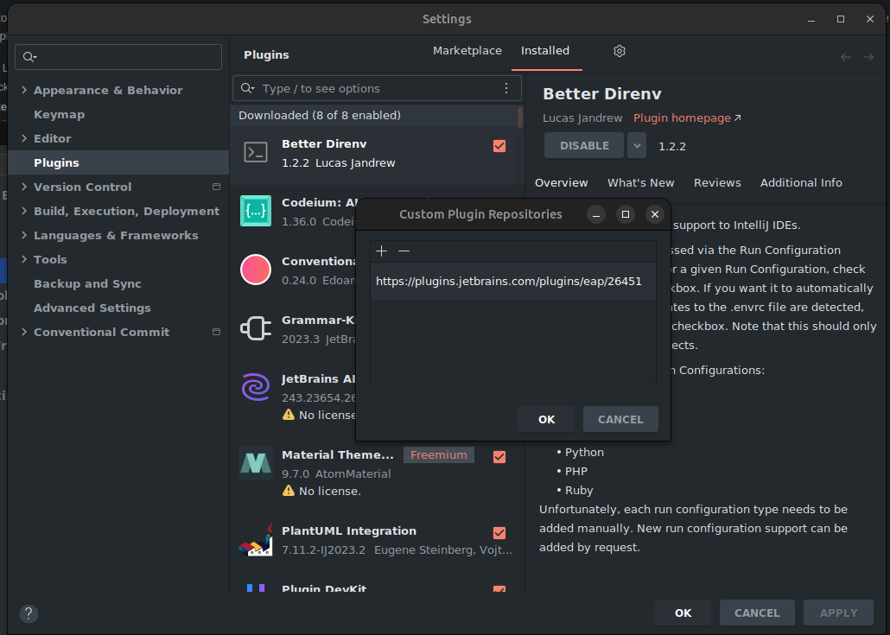

# intellij-bloblang-support
A IntelliJ-based IDEs plugin for [bloblang](https://www.benthos.dev/docs/guides/bloblang/about) support.

Bloblang is a  mapping language developed by @jeffail as part of [benthos](https://github.com/benthosdev/benthos), a high performance and resilient stream processor.

## Features
This pliugin recognizes the files `*.blobl` as bloblang files and check and highlight the syntax of these files. Fot more details tou can check the [CHANGELOG](CHANGELOG.md).

## Install
### From Marketplace
This alternative the easier to keep the plugin updated. Since the plugin is in the very beginning of its development, it isn't in the stable channel but in the EAP. For installing plugins from this channel you have to add the repository to your plugins repositories list.
1. Press `Ctrl+Alt+S` (or `⌘ ,` in Mac) to open the IDE settings and select **Plugins**.
2. On the Plugins page, click  and select **Manage Plugin Repositories**.
3. In the **Custom Plugin Repositories** dialog, click  and specify the URL `https://plugins.jetbrains.com/plugins/eap/18756`. 

4. Click OK in the Custom Plugin Repositories dialog to save the list of plugin repositories.
5. In the tab **Marketplacc** type "bloblang" to find the plugin and click **Install**.

6. Click OK in the Settings/Preferences dialog to apply the changes.

_See the [JetBrains Documentation](https://www.jetbrains.com/help/idea/managing-plugins.html?keymap=secondary_macos#repos) for more details._

### From disk
This alterantive allows you to choose the version ton install, also it avoids the Jetbrains moderation, so the last releases are available few days before than in the Marketplace.
1. Go to the **[Release Github project page](https://github.com/pcha/intellij-bloblang-support/releases)** and Download the plugin archive of the desired version, named `intellij-bloblang-support-x.y.z.zip`, where `x.y.z` is the plugin version.
2. Press `Ctrl+Alt+S` (or `⌘ ,` in Mac) to open the IDE settings and select **Plugins**.
3. On the **Plugins** page, click [The Settings button](https://resources.jetbrains.com/help/img/idea/2021.3/icons.general.gearPlain.svg) and then click **Install Plugin from Disk**.
4. Select the downloaded plugin file and click **OK**.
5. Click **OK** to apply the changes and restart the IDE if prompted.

_See the [JetBrains Documentation](https://www.jetbrains.com/help/idea/managing-plugins.html?keymap=secondary_macos#install_plugin_from_disk) for more details._

## Feedback and Contribution

### Bug Reports and Suggesting Enhancements
Everybody is welcome to report bugs and suggest enhancements. Please use the [Github Issues](https://github.com/pcha/intellij-bloblang-support/issues) page. 

### Contribute with Pull Requests
If you want to contribute with code, you're Wellcome! Please follow the next guidelines:

- Make an Issue, if it doesn't already exist, and express your desire of contributing in the development, that way we can organize ourselves and avoid to work in the same feature or bug.
- Use [Conventional Commit](https://www.conventionalcommits.org/en/v1.0.0/) Messages. This is used for the changelog and version generation.
- For the moment the project doesn't have any test, so please be sure of test that the plugin is still working before push.
- To test the plugin behavior the gradle task runIde can be used, this task regenerate the parser files, build the plugin and run the plugin in the IDE. (see the [JetBrains Documentation](https://plugins.jetbrains.com/docs/intellij/gradle-prerequisites.html#executing-the-plugin) for more details)
- If want to test the plugin in a specific IDE or version you can change in the `Intellij` block of the [build gradle file](build.gradle.kts). _See the [Gradle Intellij Plugin documentation](https://github.com/JetBrains/gradle-intellij-plugin/) for more details._